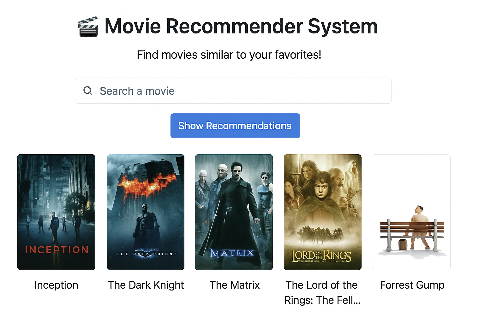

# 🎬 Movie Recommender System

A **content-based movie recommendation system** built with **Python, Streamlit, and TMDB API**.  
It recommends 5 similar movies to the one selected by the user and displays their **posters & titles** in a clean web app interface.  

---

## 📌 Overview

Recommender systems are widely used by platforms like **Netflix, Amazon, and YouTube** to enhance user experience by suggesting relevant content.  
This project demonstrates how to build a **content-based recommendation engine** using cosine similarity on movie metadata.  

The app is deployed using **Streamlit**, making it interactive and user-friendly. 

## 🔥 User Interface

---

## 🚀 Features

- 🔎 **Search any movie** from a dropdown list.  
- 🎥 **Get 5 similar movie recommendations** instantly.  
- 🖼️ **Movie posters displayed** using TMDB API.  
- 💡 Built with **content-based filtering** using cosine similarity.  
- ⚡ Lightweight and easy to run locally or deploy online.  

---

## 🛠️ Tech Stack

- **Python**
- **Streamlit** (for UI)
- **Scikit-learn** (cosine similarity)
- **Pickle** (for model persistence)
- **Requests** (to fetch posters via TMDB API)
- **Pandas / Numpy**

---

